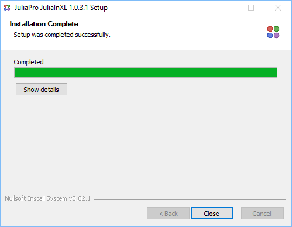
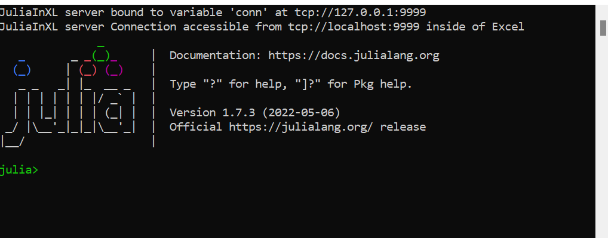
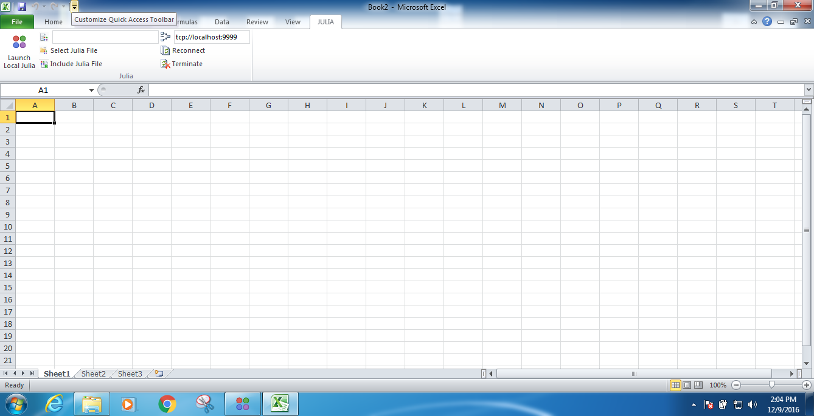
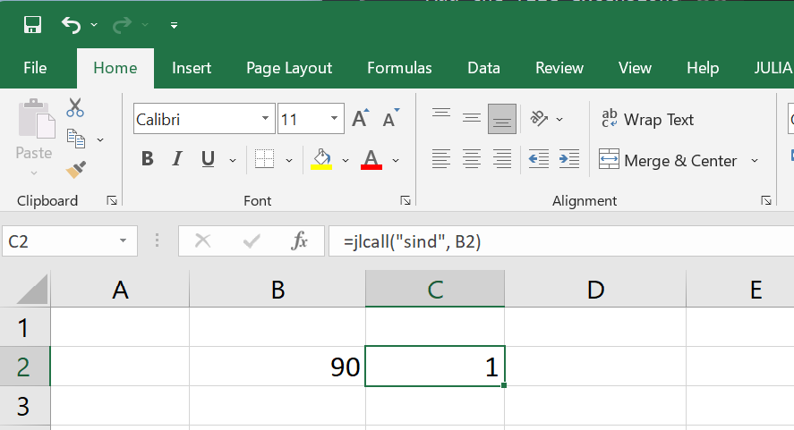

# JuliaInXL 

[](https://docs.juliahub.com/JuliaInXL/AZenl/1.2.0/)
[](https://juliahub.com/ui/Packages/JuliaInXL/AZenl)

JuliaInXL.jl is a Julia package that allows Julia functions to be called from within Microsoft Excel. This software
included Julia code that is present in this repository, and a corresponding [native (ie XLL) plugin](https://github.com/JuliaComputing/JuliaInXL)

## Prerequisites

* An appropriate version of Microsoft® Windows®
* Windows 10 or above
* Windows Server 2012 or above
* Julia 1.6 or above
* .NET 4.0 (Bundled with the JuliaInXL installer when executed with Administrator privileges)
* Microsoft Excel® 2010, 2013, 2016 or 365

## Installation 

The Julia package can be installed directly using the package manager. 

```
> add JuliaInXL
```

As part of instaling the Julia package, the native plugin will be downloaded, and it's installer executed. 

Upon completion of the installer, press close to exit the installer.



If the installer did not popup during the installation of the JuliaInXl.jl package - or if you previously installed and removed the addin, you may need to trigger a rebuild:

```
(@v1.8) pkg> build   
```

(or `julia> import Pkg; Pkg.build()`)

## Quick Usage Guide

If JuliaInXL was installed via the package manager, then in most cases a Julia process should launch automatically when starting your Excel session.



A Julia tab will also be present in the Office Ribbon that contains a number of buttons and text boxes for controlling the connection between Julia and Excel, as well as loading functionality into the current Julia process.



Julia code can be evaluated using the `jleval` worksheet function, which takes a string of julia code and evaluates it in the REPL. This is the simplest way to use JuliaInXL and it's functionally equivalent to typing the string in the REPL. You also need to worry less about types.

Julia functions can be called from Excel using the jlcall worksheet function. The first argument to jlcall is a string, which is the name of the registered Julia function to be called. Subsequent arguments to the jlcall function are passed as parameters to the Julia function being called. These can be constant literals, or cell references.

Note that excel only supports `strings`, `floats` and `dates` so `jlcall` may fail if you call a function with an `integer` or another type in the function signature. You will be notified of this error with a MethodError, both in Excel and in the Julia REPL.



## Workflow Tips

- Both `jlcall` and `jleval` will act as [array formulas](https://support.microsoft.com/en-us/office/guidelines-and-examples-of-array-formulas-7d94a64e-3ff3-4686-9372-ecfd5caa57c7) if the return type of the julia expression is an array. Select the expected area and type Control + Shift + Enter instead of enter while inputting the formula to get all the cells. Dynamic array support will be added in a later release.
- The suggested usage of this package is for communication of data between a Julia process and Excel - if you find yourself using Excel as a julia REPL or as an IDE, we suggest alternatives like Pluto or VSCode with the Julia Extension. Both are available on [Juliahub.com](https://juliahub.com).
- The dependency analysis of Excel doesn't work very smoothly with `jlcall` or `jleval` so it is recommended to use any cell as an input only. If `B2 = A1 + jleval("1")`, `B2` will **NOT** update if `A1` changes. This is a known limitation which may be lifted in future versions.
- To maximize reproducibility, keep big chuncks of code in files and try to use a Project/Manifest to record dependencies. Test the Julia code in the REPL and then import results or run analyses on Excel.

### Further documentation 

See our [documentation](https://docs.juliahub.com/JuliaInXL/AZenl/1.2.0/) for details on how to use this package. 

### Trademarks

Microsoft<sup>®</sup>, Windows<sup>®</sup>, Office<sup>®</sup> and Excel<sup>®</sup> are registered trademarks of Microsoft Corporation.

Other names may be trademarks of their respective owners.
