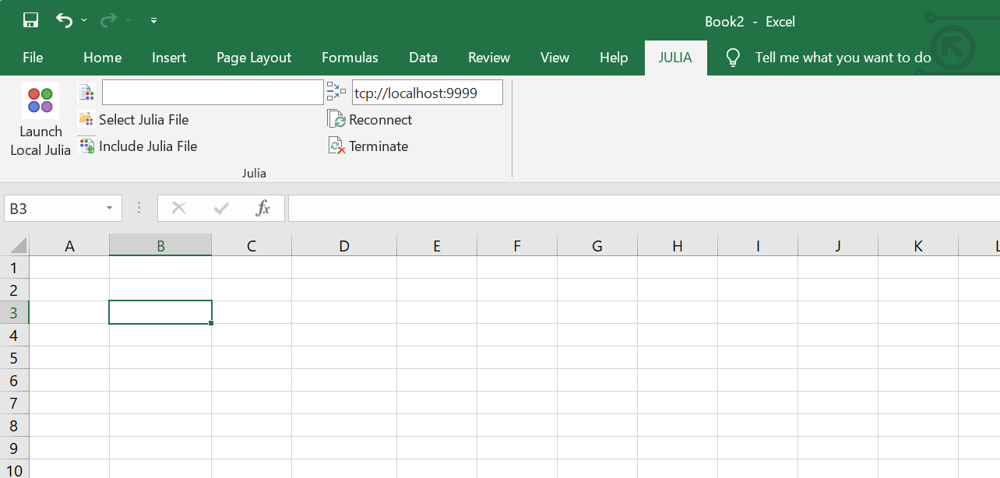

# JuliaInXL 

[](https://docs.juliahub.com/JuliaInXL/AZenl/1.2.0/)
[](https://juliahub.com/ui/Packages/JuliaInXL/AZenl)

JuliaInXL.jl is a Julia package that allows Julia functions to be called from within Microsoft Excel. This software
included Julia code that is present in this repository, and a corresponding [native (ie XLL) plugin](https://github.com/JuliaComputing/JuliaInXL)

## Prerequisites

* An appropriate version of Microsoft® Windows®
* Windows 10 or above
* Windows Server 2012 or above
* Julia 1.6 or above
* .NET 4.0 (Bundled with the JuliaInXL installer when executed with Administrator privileges)
* Microsoft Excel® 2010, 2013, or 2016 

## Installation 

The Julia package can be installed directly using the package manager. 

```
> add JuliaInXL
```

As part of instaling the Julia package, the native plugin will be downloaded, and it's installer executed. 

Upon completion of the installer, press close to exit the installer.


## Quick Usage Guide

If JuliaInXL was installed via the package manager, then in most cases a Julia process should launch automatically when starting your Excel session.


A Julia tab will also be present in the Office Ribbon that contains a number of buttons and text boxes for controlling the connection between Julia and Excel, as well as loading functionality into the current Julia process.



Julia functions can be called from Excel using the jlcall worksheet function. The first argument to jlcall is a string, which is the name of the registered Julia function to be called. Subsequent arguments to the jlcall function are passed as parameters to the Julia function being called. These can be constant literals, or cell references


### Further documentation 

See our [documentation](https://docs.juliahub.com/JuliaInXL/AZenl/1.2.0/) for details on how to use this package. 

### Trademarks

Microsoft<sup>®</sup>, Windows<sup>®</sup>, Office<sup>®</sup> and Excel<sup>®</sup> are registered trademarks of Microsoft Corporation.

Other names may be trademarks of their respective owners.
