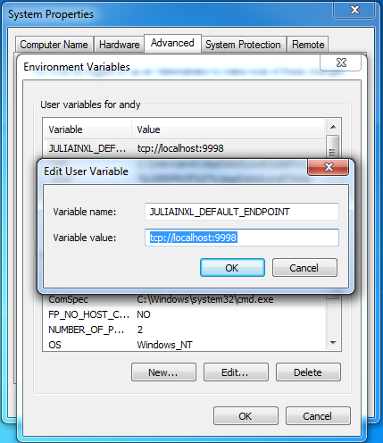
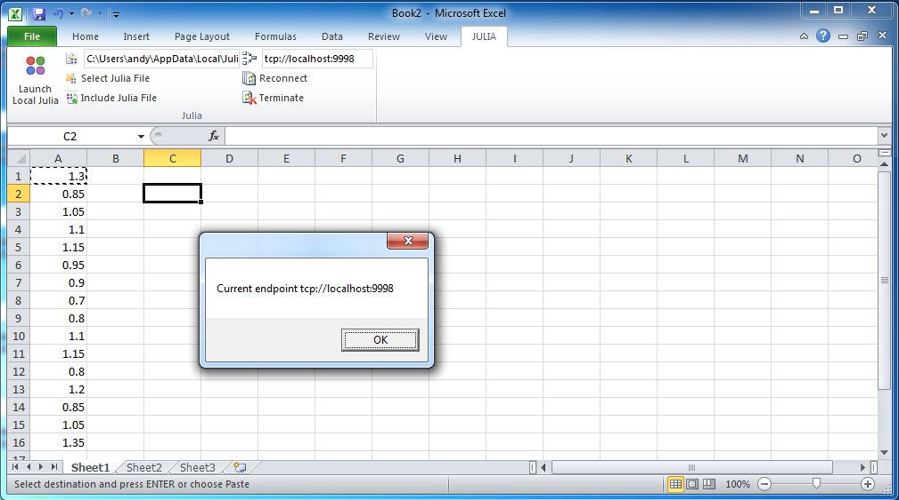

# Advanced Usage

The features described here should not be applicable to the vast majority of usage of this package. They are useful only for a small set of advanced use cases. 

## Customising the connection parameters

By default, the endpoint value displayed in this textbox is associated with the value stored in the `JuliaInXL_Default_Endpoint` entry of the JuliaInXL registry key.

For a "Current User" installation of JuliaPro, this registry key is located at `HKEY_CURRENT_USER\\Software\\JuliaProfessional\\0.5.0.4\\`.  

For an "All Users" installation of JuliaPro, this registry key is located at `HKEY_LOCAL_MACHINE\\Software\\JuliaProfessional\\0.5.0.4\\`.

For a "Shared Drive" installation of JuliaPro, no Windows registry keys are written on installation, but JuliaInXL will also look to see if an environment variable `JULIAINXL_DEFAULT_ENDPOINT` has been set.  

As shown below, for "Shared Drive" installations, you should both set a value for `JULIAINXL_DEFAULT_ENDPOINT`, and also ensure that the path to the julia.exe executable included in your Julia installation is included in a Path environment variable for either your system or your current user account.

For connections made to Julia processes executing on the local machine, the hostname included in the provided TCP endpoint should always be "localhost".  On the Julia side, the IP address `127.0.0.1` is used when creating the connection endpoint from which the JuliaInXL server can accept connections.  Connections endpoints entered into the "JuliaInXL TCP Endpoint" on the Excel side should use the DNS name associated with an IP address, while on the Julia side the IP address should be used directly.

If you wish to configure your JuliaInXL session to connect to a particular JuliaInXL server, possibly on a different machine, then the value of the current endpoint can be changed either manually in the "JuliaInXL TCP Endpoint" text box, through the Windows Registry or via an environment variable.  

Using the Windows Registry or an Environment variable allows for the possibility of connecting to a remote JuliaInXL server session as part of an automated workflow that launches Excel and makes use of Julia.

Note that with the current version of JuliaInXL, if the Excel installation has loaded the "Analysis Toolpak - VBA" Add-In, then JuliaInXL cannot be used in the automated workflow described above.

Also note that regardless of the endpoint value (e.g. `tcp://hostname:<current_port_number>`) provided within the Windows Registry, in a JULIAINXL_DEFAULT_ENDPOINT environment variable, entered manually in the "JuliaInXL TCP Endpoint" text box, if a user presses the "Launch Local Julia" button, then the endpoint value in the "JuliaInXL TCP Endpoint" text box will be updated to point to `tcp://localhost:<current_port_number>` before launching a new Julia process to create a JuliaInXL server.

## Connecting to a separate JuliaInXL server

As mentioned previously, one can connect a single Excel session to different Julia sessions by changing the port number within the Julia Office Ribbon tab.

Below is an example of changing the port number of the current Julia session from the default 9999 port to 9998.

And then connecting that same Excel session to a separate Julia session where a different connection object has been associated with the new port number.

