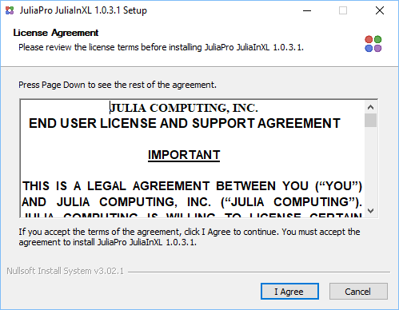

# Introduction

## Overview

JuliaInXL is an extension of Microsoft® Excel® that brings the power of the Julia language and ecosystem to a familiar spreadsheet work environment.

This guide details the installation procedure and usage of the JuliaInXL package for JuliaPro.

## Installation

### Prerequisites

To install JuliaInXL, the system must meet the following prerequisites

* An appropriate version of Microsoft Windows®:
 * Windows 7 SP1, Windows 8, Windows 8.1, Windows 10
 * Windows Server 2008 R2, Windows Server 2012, Windows Server 2012 R2, Windows Server 2016
* JuliaPro v1.0.3.1 (Or higher)
* .NET 4.0 (Bundled with the JuliaInXL installer when executed with Administrator privileges)
* Microsoft Excel 2010, 2013, or 2016

### Installing JuliaInXL for JuliaPro

JuliaInXL can be installed only on a Windows machine if Microsoft Excel is installed. Installation of JuliaInXL should be performed with the same set of user privileges as were used when the corresponding version of JuliaPro was installed. Open your JuliaPro IDE and execute following command to begin JuliaInXL installation: 

```
Pkg.add(“JuliaInXL”)
```

Above command will download JuliaInXL installer and initiate the installer, you will be presented with the JuliaInXL Software License Agreement. After reading through the terms mentioned in the agreement, click “I Agree” if you accept the terms of the license and proceed with the installation.



Upon completion of the installer, press close to exit the installer. Once you close the installer, you can come back to your JuliaPro IDE to use JuliaInXL.


### Uninstalling JuliaInXL

Please use “Add/Remove programs” Windows utility to uninstall JuliaInXL.


## Trademark Usage

Microsoft®, Windows®, and Excel® are registered trademarks of Microsoft Corporation.

Other names may be trademarks of their respective owners.
