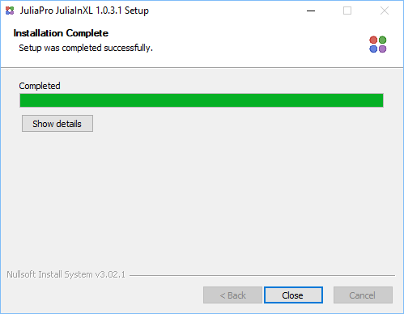
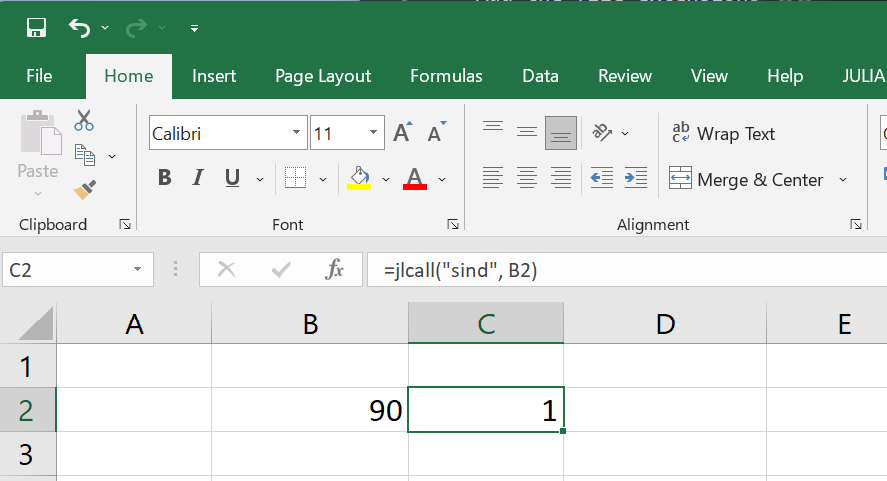

# Introduction

## Overview

JuliaInXL is an extension of Microsoft® Excel® that brings the power of the Julia language and ecosystem to a familiar spreadsheet work environment.

This guide details the installation procedure and usage of the JuliaInXL package.

## Installation

### Prerequisites

To install JuliaInXL, the system must meet the following prerequisites

* An appropriate version of Microsoft Windows®:
* Windows 10 or higher
* Windows Server 2012 R2 or higher
* Julia v1.6 or higher
* .NET 4.0 (Bundled with the JuliaInXL installer when executed with Administrator privileges)
* Microsoft Excel 2010 or higher

### Installing JuliaInXL

The JuliaInXL system is composed of two parts, a Julia package and an Excel Plugin. The Excel plugin itself consists of an XLL add-in.

JuliaInXL can be installed only on a Windows machine, where Microsoft Excel is installed. In your Julia session, invoke the package mode via `]`, and  

```
] add JuliaInXL
```

This command will download plugin installer installer and initiate it. 

You will be presented with the JuliaInXL Software License Agreement (MIT License). After reading through the terms mentioned in the agreement, click “I Agree” if you accept the terms of the license and proceed with the installation.

Upon completion of the installer, press close to exit the installer.



## Quick Usage Guide

If JuliaInXL was installed via the package manager, then in most cases a Julia process should launch automatically when starting your Excel session.


A Julia tab will also be present in the Office Ribbon that contains a number of buttons and text boxes for controlling the connection between Julia and Excel, as well as loading functionality into the current Julia process.


Julia functions can be called from Excel using the jlcall worksheet function. The first argument to jlcall is a string, which is the name of the registered Julia function to be called. Subsequent arguments to the jlcall function are passed as parameters to the Julia function being called. These can be constant literals, or cell references



### Further documentation 

See the [tutorial](./tutorial.html) for a detailed usage instructions. See the [troubleshooting docs](./trouble.html) for potential solutions if you hit any issues. 

### Uninstalling JuliaInXL

Please use “Add/Remove programs” Windows utility to uninstall JuliaInXL.

## Trademark Usage

Microsoft®, Windows®, and Excel® are registered trademarks of Microsoft Corporation.

Other names may be trademarks of their respective owners.
