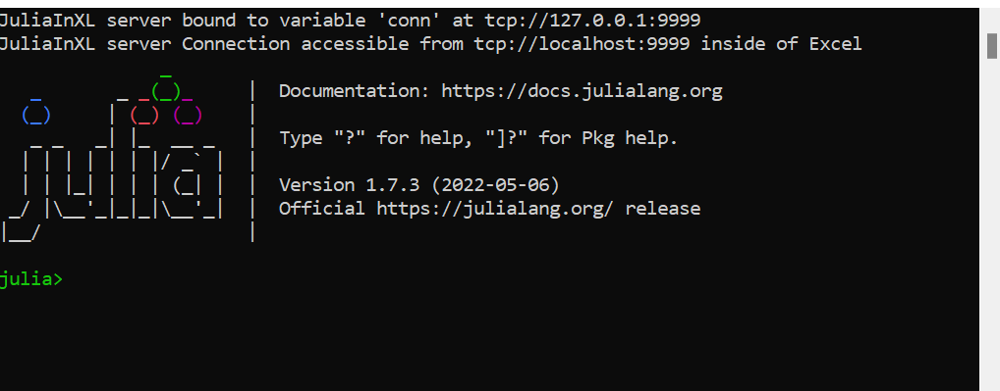

# Using JuliaInXL for JuliaPro

## Julia Office Ribbon Tab
---------------------------

If JuliaInXL was selected as a component to install with your JuliaPro installation, then in most cases a Julia process should launch automatically when starting your Excel session.



A Julia tab will also be present in the Office Ribbon that contains a number of buttons and text boxes for controlling the connection between Julia and Excel, as well as loading functionality into the current Julia process.


In the current version of JuliaInXL, if your Excel installation has loaded the "Analysis Toolpak - VBA" add-in, then the Julia process does not launch automatically on startup.  In this scenario, you must launch the julia.exe process manually using the "Launch Local Julia" button as shown below.


The "Launch Local Julia" button will launch a new child Julia process, as well as start a JuliaInXL server process that listens on the currently defined TCP endpoint.

When this button is pressed, any current child Julia process is shutdown before launching a new Julia process.

If an execution of `jlcall` has resulted in a `#JuliaNotConnected` error, then either the "Launch Local Julia" button or the "Reconnect" button (described below) can be used to re-establish a connection to a JuliaInXL server process.  The "Launch Local Julia" button launches a new julia.exe process, while the "Reconnect" button attempts to connect to a JuliaInXL server in an existing julia.exe process.

Adjacent to the "Launch Local Julia" button is a "Julia File Path" text box for entering the path to a file that can be loaded into the Julia process via the `include` command.


Below the "Julia File Path", is a "Select Julia File" button, which launches a file chooser dialog box that allows for browsing to a Julia file that can be loaded into the current Julia process.


Selecting a file using this dialog box only populates the "Julia File Path" text box with the path to the file selected.


With a file selected via the "Select Julia File" button or manually entered into the "Julia File Path" text box, the selected file can be loaded into the Julia process using the "Include Julia File" button.


In the screenshot below, we have included the "sim.jl" file from the "test" directory of the JuliaInXL package installation.  The `simulate` function defined in `sim.jl` is now available for use from the current Julia process and is callable from Excel via `jlcall` as described in a later section.


Adjacent to the "Julia File Path" text box is the "JuliaInXL TCP Endpoint" textbox.  This textbox displays the currently configured TCP endpoint to use when Excel connects to a JuliaInXL server.  


By default, the endpoint value displayed in this textbox is associated with the value stored in the "JuliaInXL_Default_Endpoint" entry of the JuliaPro Windows registry key.

For a "Current User" installation of JuliaPro, this registry key is located at "HKEY_CURRENT_USER\\Software\\JuliaProfessional\\0.5.0.4\\".  

For an "All Users" installation of JuliaPro, this registry key is located at "HKEY_LOCAL_MACHINE\\Software\\JuliaProfessional\\0.5.0.4\\".

For a "Shared Drive" installation of JuliaPro, no Windows registry keys are written on installation, but JuliaInXL will also look to see if an environment variable JULIAINXL_DEFAULT_ENDPOINT has been set.  

As shown below, for "Shared Drive" installations, you should both set a value for JULIAINXL_DEFAULT_ENDPOINT, and also ensure that the path to the julia.exe executable included in your JuliaPro installation is included in a Path environment variable for either your system or your current user account.


For connections made to Julia processes executing on the local machine, the hostname included in the provided TCP endpoint should always be "localhost".  On the Julia side, the IP address `127.0.0.1` is used when creating the connection endpoint from which the JuliaInXL server can accept connections.  Connections endpoints entered into the "JuliaInXL TCP Endpoint" on the Excel side should use the DNS name associated with an IP address, while on the Julia side the IP address should be used directly.

If you wish to configure your JuliaInXL session to connect to a particular JuliaInXL server, possibly on a different machine, then the value of the current endpoint can be changed either manually in the "JuliaInXL TCP Endpoint" text box, through the Windows Registry or via an environment variable.  

Using the Windows Registry or an Environment variable allows for the possibility of connecting to a remote JuliaInXL server session as part of an automated workflow that launches Excel and makes use of Julia.

Note that with the current version of JuliaInXL, if the Excel installation has loaded the "Analysis Toolpak - VBA" Add-In, then JuliaInXL cannot be used in the automated workflow described above.

Also note that regardless of the endpoint value (e.g. tcp://hostname:<current_port_number>) provided within the Windows Registry, in a JULIAINXL_DEFAULT_ENDPOINT environment variable, entered manually in the "JuliaInXL TCP Endpoint" text box, if a user presses the "Launch Local Julia" button, then the endpoint value in the "JuliaInXL TCP Endpoint" text box will be updated to point to "tcp://localhost:<current_port_number>" before launching a new Julia process to create a JuliaInXL server.

Below the "JuliaInXL TCP Endpoint" textbox is the "Reconnect" button.  This button resets the TCP client endpoint on the Excel side of the connection, and then attempts to reconnect to the existing JuliaInXL server.  


If an execution of `jlcall` has resulted in a `#JuliaNotConnected` error, then either the "Launch Local Julia" button or the "Reconnect" button (described below) can be used to re-establish a connection to a JuliaInXL server process.  The "Launch Local Julia" button launches a new julia.exe process, while the "Reconnect" button attempts to connect to a JuliaInXL server in an existing julia.exe process.

The "Terminate" button disconnects the TCP client endpoint on the Excel side of the connection.


## Calling Julia Functions from Excel using `jlcall`

Once the server is started, julia functions can be called from Excel using the `jlcall` worksheet function. The first argument to `jlcall` is a string, which is the name of the registered Julia function to be called. Subsequent arguments to the `jlcall` function are passed as parameters to the Julia function being called. These can be constant literals, or cell references. Arrays can be passed via cell ranges.

If the Julia function returns an array (1d or 2d), then use `jlcall` as an Excel Array function by selecting a range before entering the function, and pressing `Shift+Ctrl+Enter` to finish.
Functions exposed to Excel should take floats or strings, or their arrays as arguments. In general, it is a good idea to keep the function arguments as loosely typed as possible. Therefore functions should return integers, floats, or strings; or their arrays. However, arrays of dimensions greater than two are not supported.
Note that [Excel stores all numbers as 64 bit IEEE floats](https://support.microsoft.com/en-us/kb/78113). Therefore, be aware of the possibility of truncation if returning large, or high precision, numbers.
Dates are passed in from excel as floating point numbers in its internal encoding (fractional days since 1/1/1900 or 1/1/1904). Thus, they are recieved in Julia functions as floats. They can be converted to Julia DateTime values using the xldate function.

Below we show the initial entry of `jlcall` being called within a cell.


And the completion of that statement calling the `simulate` function from our example.


As well as the corresponding result:


By copying the contents of the cell in which `jlcall` was executed into multiple cells, the original `jlcall` operation can be repeated within multiple cells.


### Resolving `#JuliaNotConnected!` error messages

If an execution of `jlcall` has resulted in a `#JuliaNotConnected!` error, then either the "Launch Local Julia" button or the "Reconnect" button (described below) can be used to re-establish a connection to a JuliaInXL server process.  The "Launch Local Julia" button launches a new julia.exe process, while the "Reconnect" button attempts to connect to a JuliaInXL server in an existing julia.exe process.

### Resolving `#JuliaEmptyCell!` error messages

The `jlcall` function does not currently accept arguments whose inputs are cells or cell ranges that contain empty cells.  To resolve a `#JuliaEmptyCell!` error, the input cells or cell ranges must be modified such that they contain a value of some type.

## Defining global variables via `jlsetvar`

If you wish to assign a value to a variable within the current Julia process, a `global` variable can be created through the use of the `jlsetvar` function in Excel.  

`jlsetvar` accepts two arguments, where the first argument is a text string for the name of the variable to be created and the second argument is a numeric value, a string value, or a cell reference or cell range whose contents are numbers or strings.

## Executing a Julia expression via `jleval`

If you wish to define a Julia expression to be evaluated in the Julia process hosting the JuliaInXL server, the `jleval` function accepts a single string argument whose contents must be able to be evaluated by the julia function:

```
parse_and_eval(arg) = eval(parse(arg::String))
```

## Connecting to a separate JuliaInXL server

As mentioned previously, one can connect a single Excel session to different Julia sessions by changing the port number within the Julia Office Ribbon tab.

Below is an example of changing the port number of the current Julia session from the default 9999 port to 9998.


And then connecting that same Excel session to a separate Julia session where a different connection object has been associated with the new port number.

